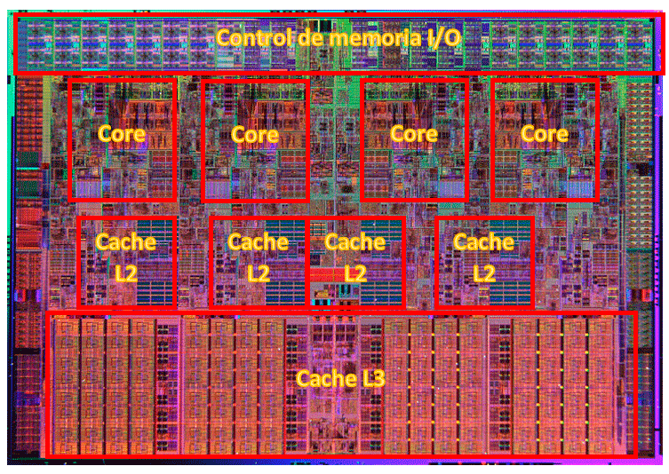

# CPU en profundidad

Si nos damos cuenta, todos los datos que circulan por nuestra máquina son impulsos eléctricos, compuestos por señales de **unos y ceros llamados bits**. Cada una de estas señales se agrupan en un conjunto de bits que forman las instrucciones y los programas. El microprocesador es el encargado de dar sentido a todo esto realizando operaciones básicas: **SUMA, RESTA, AND, OR, MUL, DIV, OPUESTO E INVERSO**. Entonces tenemos que el microprocesador:

- **Decodifica y ejecuta** las instrucciones de los programas cargados en la memoria principal del ordenador.

- **Coordina y controla todos los componentes** que forman el ordenados y los periféricos que están conectados a este, mouse, teclado, impresora, pantalla, etc.

  

### Arquitectura de Von Neumann

Desde la invención de los microprocesadores hasta día de hoy estos están basados en una arquitectura que divide el procesador en varios elementos que luego veremos. Esta recibe el nombre de **arquitectura de Von Neumann.**

Los procesadores actuales aún están basados en su gran mayoría en esta arquitectura básica, aunque lógicamente se han introducido gran cantidad de elementos nuevos hasta contar con los extremadamente completos elementos que hoy día tenemos. Posibilidad de múltiples números en un mismo chip, elementos de memoria en varios niveles, procesador de gráficos incorporado, etc.

### Partes internas de un procesador

Las partes básicas de un ordenador según esta arquitectura son las siguientes:

- **Memoria:** es el elemento en donde se guardan las instrucciones que ejecuta el computador y los datos sobre los que operan las instrucciones. Estas instrucciones reciben el nombre de programa.

- **Unidad Central de Proceso o CPU:** es el elemento que ya hemos definido anteriormente. Es el encargado de procesar las instrucciones que le llegan de la memoria.

- **Unidad de entrada y salida:** permite la comunicación con los elementos del exterior.

- **Buses de datos:** son las pistas, vías o cables que conectan físicamente la memoria, la CPU y la unidad de entrada y salida

### Elementos de un microprocesador

**Unidad de control (UC):** es el elemento que se encarga de impartir las órdenes mediante las señales de control, por ejemplo, el reloj. Busca las instrucciones en la memoria principal y las pasa al decodificador de instrucciones para que se ejecuten. Sus partes internas son:

- **Reloj:** genera una onda para sincronizar las operaciones del procesador.

- **Contador de programa:** contiene la dirección de memoria de la siguiente instrucción que se va a ejecutar.

- **Registro de instrucciones:** contiene la instrucción que se está ejecutando actualmente.

- **Secuenciador:** genera órdenes elementales para el procesamiento de la instrucción.

- **Decodificador de instrucciones (DI):** se encarga de interpretar y ejecutar las instrucciones que llegan, extrayendo el código de operación de la instrucción.

**Unidad aritmético lógica (ALU):** se encarga de hacer los cálculos aritméticos (SUMA, RESTA, MULTIPLICACION, DIVISION) y operaciones lógicas (AND, OR, …). Sus partes internas son:

- **Circuito operacional:** contienen los multiplexores y circuitos para hacer operaciones.

- **Registros de entrada:** se almacenan los datos y operado antes de entrar al circuito operacional.

- **Acumulador:** almacena los resultados de las operaciones realizadas.

- **Registro de estado (Flag):** almacena ciertas condiciones que deben ser tenidas en cuenta en operaciones posteriores.

**Unidad de coma flotante (FPU):** este elemento no estaba en el diseño original de la arquitectura, posteriormente fue introducido cuando las instrucciones y cálculos se hicieron más complejos con la aparición de los programas representados gráficamente. Esta unidad se encarga de realizar las operaciones en coma flotante, es decir, números reales.

**Banco de registros y la memoria caché (Cache):** los procesadores actuales cuentan con una memoria volátil que hace de puente desde la memoria RAM hasta la CPU. Esta es mucho más rápida que la memoria RAM y se encarga de acelerar los accesos del microprocesador a la memoria principal.

**Bus frontal (Front Side Bus, FSB):** También se conoce como bus de datos, bus principal o bus de sistema. **Es la vía o canal que comunica el microprocesador con la placa base, concretamente con el chip llamado puente norte o nothbridge.** Este se encarga de controlar el funcionamiento del bus principal de la CPU, la RAM y los puertos d expansión como son los PCI-Express. Los términos utilizados para definir a este bus son “Quick Path Interconnect” para Intel y “Hypertransport” para AMD, en Ryzen (Infinity Fabric).

**Bus trasero (Back Side BUS, BSB):** **este bus comunica la memoria cache de nivel 2 (L2)** con el procesador, siempre y cuando esta no esté integrada en el propio núcleo de la CPU. En la actualidad todos los microprocesadores disponen de memoria cache integrada en el propio chip, por lo que este bus también forma parte del mismo chip.

### Microprocesador de dos o más núcleos

En un mismo procesador no solamente tendremos estos elementos distribuidos en su interior, sino que además ahora se encuentran replicados. Dispondremos de varios núcleos de procesamiento o lo que es lo mismo varios microprocesadores dentro de la unidad. Cada uno de estos contará con su propia memoria caché L1 y L2, **normalmente la L3 se reparte entre ellos, a pares o en conjunto.**

Además de esto contaremos con una ALU, UC, DI y FPU para cada uno de los núcleos por lo que la velocidad y capacidad de procesamiento se multiplican en función de la cantidad de núcleos que tenga. También aparecen nuevos elementos dentro de los microprocesadores:

- **Controlador de memoria integrado (IMC):** Ahora con la aparición de varios núcleos el procesador cuenta con un sistema que le permite acceder directamente a la memoria principal.

- **GPU integrada (iGP):** la GPU se encarga del procesamiento de gráficos. Estos son en su mayoría operaciones de coma flotante con cadenas de bits de gran densidad, por lo que el procesamiento es mucho más complejo que los datos de programa normales. Debido a esto, existen gamas de microprocesador que implementan en su interior una unidad exclusivamente destinada al procesamiento de gráficos.

*Algunos procesadores, como los AMD Ryzen, no integran tarjeta gráfica interna. Sólo sus APU.*

### Núcleos e hilos

Los núcleos definen la cantidad de procesos que maneja un procesador, y **los hilos definen el total de subprocesos con los que puede trabajar.** Esto significa que un procesador de seis núcleos cuenta con seis unidades de procesamiento (seis hilos de ejecución) que pueden trabajar en seis tareas diferentes al mismo tiempo. Si ese procesador cuenta con la tecnología HyperThreading (Intel) o SMT (AMD) podrá trabajar, además, con un subproceso adicional por cada núcleo físico, lo que en este caso nos dejaría un total de doce hilos de ejecución.

### Funcionamiento de un microprocesador

Un procesador funciona mediante instrucciones, cada una de estas instrucciones **es un código binario** de una determinada extensión que la CPU es capaz de entender.

**Un programa**, por tanto, **es un conjunto de instrucciones** y para ejecutarlo se debe realizar de forma secuencial, esto es, ejecutando en cada paso o período de tiempo una de estas instrucciones. Para ejecutar una instrucción hay varias fases:

- **Búsqueda de la instrucción:** traemos la instrucción desde la memoria al procesador.

- **Decodificación de la instrucción:** la instrucción se divide en códigos más simple entendibles por la CPU.

- **Búsqueda de operandos:** con la instrucción cargada en la CPU hay que buscar el operador que corresponder.

- **Ejecución de la instrucción:** se realiza la operación lógica o aritmética necesaria.

- **Almacenamiento del resultado:** el resultado se almacena en la memoria caché.

Cada procesador trabaja con un determinado conjunto de instrucciones, estas han ido evolucionando a la vez que los procesadores. La denominación de x86 o x386 se refiere al conjunto de instrucciones con las que un procesador trabaja.

Tradicionalmente a los procesadores de 32 bits se las ha llamado también x86, esto se debe a que en esta arquitectura han trabajado con este conjunto de instrucciones desde el procesador Intel 80386 que fue el primero en implementar una arquitectura de 32 bits.

Este conjunto de instrucciones es necesario actualizarlo para trabajar más eficientemente y con programas más complejos. A veces vemos que en los requisitos para que un programa se ejecute vienen un conjunto de siglas como SSE, MMX, etc. Estas son el conjunto de instrucciones con las que un microprocesador puede lidiar. Así tenemos:

- **SSE (Streaming SIMD Extensions):** dotaron a las CPU para trabajar con operaciones en coma flotante.

- **SSE2, SSE3, SSE4, SSE5, etc:** distintas actualizaciones de este conjunto de instrucciones

### Incompatibilidad entre procesadores

Todos recordamos cuando un sistema operativo de Apple no se podía ejecutar en un PC con Windows o Linux. Esto es debido al tipo de instrucciones de los distintos procesadores. Apple usada procesadores PowerPC, que trabajaban con unas instrucciones distintas a Intel y AMD. De esta forma existen varios diseños de instrucciones:

- **CISC (Complex Instruction Set Computer):** es la que utilizan Intel y AMD, se trata de utilizar un conjunto de pocas instrucciones, pero complejas. Tienen mayor consumo de recursos, al ser instrucciones más completas que necesitan varios ciclos de reloj.

- **RISC (Reduced Instruction Set Computer):** es la que utilizaban Apple, Motorola, IBM y PowerPC, estos son procesadores más eficientes al contar con más instrucciones, pero de menor complejidad.

*Actualmente ambos sistemas operativos son compatibles porque Intel y AMD implementan una combinación de arquitecturas en sus procesadores.*

### Proceso de ejecución de una instrucción

1. El procesador se reinicia al recibir una señal de RESET, de esta forma se prepara el sistema recibiendo una señal de reloj que determinará la velocidad del proceso.

2. En el registro CP (contador de programa) se carga la dirección de memoria en la que empieza el programa.

3. La unidad de control (UC) emite la orden para traer la instrucción que la RAM tiene almacenada en la dirección de memoria que hay en el CP.

4. A continuación, la RAM envía el dato y este se coloca en el bus de datos hasta que se almacena en el RI (Registro de instrucción).

5. La UC gestiona el proceso y la instrucción pasa al decodificador (D) para hallar el significado de la instrucción. Seguidamente esta pasa por la UC para ser ejecutada.

6. Una vez que se sabe cuál es la instrucción y qué operación se debe realizar, se cargan ambas en los registros de entrada (REN) de la ALU.

7. La ALU ejecuta la operación y coloca el resultado en el bus de datos y al CP se le suma 1 para ejecutar la siguiente instrucción.

### Anchura del bus

**La anchura de un bus determina el tamaño de los registros que pueden circular por él.** Esta anchura debe coincidir con el tamaño de los registros del procesador. De esta forma tenemos que la anchura que tiene el bus representa el registro más grande que este es capaz de transportar en una sola operación.

Directamente relacionado con el bus estará también la memoria RAM, este debe ser capaz de almacenar cada uno de estos registros con la anchura que estos tengan.

Lo que tenemos actualmente en cuando a ancho de bus es 32 bits o 64 bits, es decir, podremos transportar, almacena y procesar de forma simultánea cadenas de 32 o 64 bits.

Con 32 bits teniendo cada uno la posibilidad de ser 0 o 1 podremos direccionar una cantidad de memoria de 232 (4GB) y con 64 bits 16 EB Exabytes. Esto no significa que tengamos 16 Exabytes de memoria en nuestro equipo, sino que representa la capacidad de dirección y utilizar una determinada cantidad de memoria.

**De aquí sale la famosa limitación de los sistemas de 32 bits de direccionar solamente 4 GB de memoria.**

### Memoria Caché

Estas memorias son mucho más pequeñas que la memoria RAM pero mucho más rápidas. **Su función es almacenar las instrucciones que justamente se van a procesar o las últimas procesadas.** Mientras más memoria caché, mayor será la velocidad de transacciones que la CPU pueda coger y soltar.

Aquí debemos de ser conscientes de que todo lo que llega al procesador provienen del disco duro, y este se puede decir que es tremendamente más lento que la memoria RAM y aún mucho más que la memoria caché. Es por este motivo por lo que se diseñaron estas memorias en estado sólido, para solución el gran cuello de botella que es el disco duro.

Y nos preguntaremos, porqué entonces no fabrican solamente memorias cachés de gran tamaño, la respuesta es simple, porque son muy caras.

### Velocidad interna del procesador

La velocidad es la frecuencia de reloj a la que trabajar el microprocesador. **Cuanto mayor sea esta velocidad más cantidad de operaciones por unidad de tiempo será capaz de realizar.** Esto se traduce en mayor rendimiento, por eso mismo existe la memoria caché, para acelerar la toma de datos por parte del procesador para hacer siempre el máximo de operaciones por unidad de tiempo.

Esta frecuencia de reloj viene dada por una señal de onda cuadrada periódica para que cada ciclo dure el mismo tiempo y el traspaso de información sea perfecto.

Pero no todo es velocidad. Hay muchos componentes que influyen en la velocidad de un procesador. Si por ejemplo tenemos un procesador de 4 núcleos a 1,8 GHz y otro de un solo núcleo a 4,0 GHz, es seguro que el de cuatro núcleos es más rápido.

**Un Hercio representa un ciclo por segundo, un ciclo es simplemente la repetición de un suceso por unidad de tiempo, que en este caso será el movimiento de una onda. Entonces el Hercio mide la cantidad de veces que se repite una onda en el tiempo (en este caso cada un segundo).**

| Nombre      | Símbolo | Valor (Hz)    |
| ----------- | ------- | ------------- |
| Microhercio | µHz     | 0,000001      |
| Milihercio  | mHz     | 0,001         |
| Hercio      | Hz      | 1             |
| Decahercio  | daHz    | 10            |
| Hectoercio  | hHz     | 100           |
| Kilohercio  | kHz     | 1.000         |
| Megahercio  | MHz     | 1.000.000     |
| Gigahercio  | GHz     | 1.000.000.000 |

### IPC de un procesador

**El cálculo de IPC se realiza mediante la ejecución de un programa, calculando la cantidad de instrucciones a nivel de máquina necesarias para completarlo. El resultado final proviene de dividir el número de instrucciones por el número de ciclos de reloj de la CPU.**

**El número de instrucciones ejecutadas por reloj no es una constante para un procesador determinado, pues depende de cómo el software en particular que se está ejecutando interactúa con el procesador y, de hecho, con toda la máquina, particularmente con la jerarquía de memoria.** Sin embargo, ciertas características del procesador tienden a conducir a diseños que tienen valores de IPC superiores al promedio, como la presencia de múltiples unidades lógicas aritméticas y tuberías cortas. 

Cuando se comparan diferentes conjuntos de instrucciones, un conjunto de instrucciones más simple puede llevar a una cifra de IPC más alta que la implementación de un conjunto de instrucciones más complejo, sin embargo, el conjunto de instrucciones más complejo puede lograr un trabajo más útil con menos instrucciones. (Ejemplo de procesadores CISC y RISC).

*Por ello hay procesadores con 4 núcleos más potentes en algunas tareas que otros de 6 núcleos, debido a que esto depende de cómo se comporte el software con dicho procesador y la arquitectura del mismo.*

### Velocidad del Bus

Al igual que es importante la velocidad del procesador, también es importante la velocidad del bus de datos. La placa base siempre trabaja a una frecuencia de reloj mucho menor que la del microprocesador, por este motivo vamos a necesitar **un multiplicador** que ajuste estas frecuencias.

Si por ejemplo tenemos una placa base con un bus a una frecuencia de reloj de 200 MHz un multiplicador de 10x alcanzará una frecuencia de CPU de 2 GHz.

### Microarquitectura

**La microarquitectura de un procesador determina la cantidad de transistores que hay por unidad de distancia en él.** Esta unidad se mide actualmente en nm (nanómetros) mientras menor sea, mayor cantidad de transistores se podrá introducir, y, por tanto, mayor cantidad de elementos y circuitos integrados se podrán albergar.

Esto influye directamente en el consumo de energía, dispositivos más pequeños necesitará un menor flujo de electrones, por lo que menor será la cantidad de energía necesaria para hacer las mismas funciones que en una microarquitectura de mayor tamaño.

### Refrigeración de componentes

Debido a la enorme velocidad que alcanza la CPU, el paso de corriente genera calor. A mayor frecuencia y voltaje habrá una mayor generación de calor, por ello es necesario refrigerar este componente. Existen diversas formas de hacer esto:

- **Refrigeración pasiva:** mediante disipadores metálicos (cobre o aluminio) que incrementan la superficie de contacto con el aire mediante aletas.

- **Refrigeración activa:** además del disipador también se coloca un ventilador para proporcionar un flujo de aire forzado entre las aletas del elemento pasivo.

- **Refrigeración líquida:** consta de un circuito compuesto por una bomba y un radiador aleteado. Se hace circular el agua por un bloque situado en la CPU, el elemento líquido recoge el calor generado y lo transporta hasta el radiador, que mediante ventilación forzada disipa el calor disminuyendo nuevamente la temperatura del líquido.

- **Refrigeración por Heatpipes:** el sistema está formado por un circuito cerrado de tubos de cobre o aluminio llenos de fluido. Este fluido recoge el calor de la CPU y se evapora subiendo hasta la parte superior del sistema. En este punto hay un disipador aleteado que intercambia el calor del fluido desde el interior al aire exterior, de esta forma el fluido se condensa y vuelve a bajar hasta el bloque de la CPU.