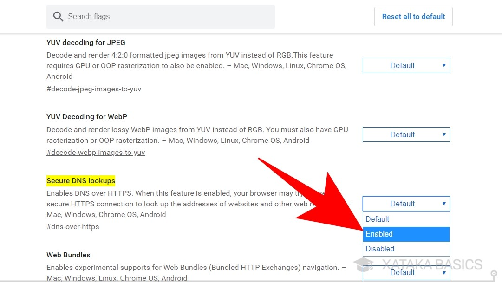

# DNS Over HTTPS

Los Servidores DNS (Sistema de Nombres de Dominio) son una de las tecnologías imprescindibles para la navegación por Internet, y suelen venir preconfiguradas en los routers que proporcionan las operadoras. Cuando entras a una web, como Xataka.com, **los servidores DNS se encargan de traducir esa dirección web en una dirección IP**, para que así tu ordenador sepa exactamente a qué servidor tiene que conectarse para acceder a los contenidos de la página.

El problema con los DNS es que realizan la conversión de letras a IP en **texto plano y sin proteger**, lo que hace que **tu navegación esté expuesta**. Esto puede abrirle las puertas a varios ataques por Internet. También permite que tu proveedor de Internet o ISP, que te da un router con un DNS preconfigurado, pueda saber siempre que te conectas cuál es tu IP y quién eres exactamente.

Ahí es donde entra en juego el protocolo **DNS mediante HTTPS**, que como su propiamente indica, realiza las resoluciones del sistema *DNS a través del protocolo HTTPS*, que aporta un **cifrado y evita que las conversiones se realicen en texto plano.** Por lo tanto, **el principal beneficio es que se aumenta la privacidad** cuando navegas por Internet, así como la seguridad evitando algunos ataques y escuchas ilegales. O por lo menos haciéndolo más difícil.

Además, las pruebas también han demostrado que se reduce la latencia a la hora de navegar, lo que quiere decir que se mejora el rendimiento y permite navegar un poco más rápido por Internet. Esto es algo que se implementa directamente en tu navegador, por lo que no necesitarás esperar a que tu operadora decida si quiere activarlo o no.

### Cómo activar el DoH en tu navegador

Activar el DoH u DNS mediante HTTPS en tu navegador es fácil, sobre todo si está basado en Chromium y lo han implementado, o si utilizas Firefox. Por ejemplo, **en Chrome sólo tienes que escribir chrome://flags/#dns-over-https** en tu barra de búsqueda. Al hacerlo, entrarás directamente en la sección de **Flags de Chrome** o funciones de prueba. Te aparecerá seleccionada la opción *Secure DNS lookups*, y lo que tienes que hacer es pulsar en la derecha donde pone *Default* y seleccionar la opción *Enabled*.