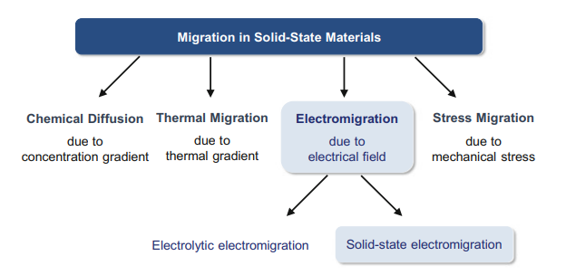

# Electromigración

En un componente electrónico, la fiabilidad siempre va marcada por un parámetro que en mayor o menor medida dicta la longevidad total del silicio: la llamada **electromigración**.

Es sin duda un tema bastante complejo y que trae de cabeza a los ingenieros en sistemas electrónicos, porque a cada nuevo producto y proceso litográfico las condiciones de los materiales cambian. Por ello, no podemos hablar de **electromigración** a un componente en concreto, sino al conjunto de todos ellos, como concepto general.

### Migración de material por campo eléctrico o Electromigración, ¿qué es?

La *electromigración* es solamente uno de los pasos de la llamada «Migración del material». Este nuevo concepto se divide en cuatro apartados muy concretos:

- Difusión química por gradientes de **concentración.**
- Migración causada por **gradientes de temperatura.**
- Migración causada por **tensión mecánica.**
- Y migración por **campo eléctrico.**

Evidentemente no todas se asocian al sector de PC como tal, pero de las cuatro causas de la migración de un material como tal dos sí están estrechamente relacionadas: **la causada por gradientes de temperatura** y **la causada por campos eléctricos.**

A este último se la conoce como **Electromigración**, pero en chips de PC como las CPU y GPU se la asocia irremediablemente también con la migración por gradientes de temperatura. Ambas forman el concepto general de *Electromigración*, el cual está extendido por foros y webs, por lo cual es interesante entender desde donde viene dicho término.

### Todos los chips la sufren, pero ¿se puede prevenir?

La *electromigración* **es un proceso de degradación del flujo de corriente** que parte con la característica intrínseca de que no hay manera de detenerla. Desde el momento en el que el chip sale de la oblea y se prueba en un banco con corriente, dicho chip está electromigrando, **no hay forma de pausarlo o prevenirlo**, es innato a la naturaleza de los propios materiales y procesos de fabricación.

Como era de esperar leyendo los dos tipos de migración de los que hemos hablado, **la temperatura es clave para este efecto.** Es lo único que es capaz de «retrasar» el efecto degradatorio que se produce en los electrones de los materiales eléctricos. La densidad de la corriente en los materiales conductores produce un aumento de temperatura debido a lo que se conoce como **«calentamiento de Joule»**, **la cual especifica que cuando una corriente eléctrica pasa a través de un conductor esta produce calor.**

**El aumento del calor debido a Joule acelera el factor de difusión de los electrones en el material y por lo tanto aumenta el grado de electromigración. Una menor temperatura provoca el efecto contrario** y consigue que en el material se produzcan menos «vacíos» entre electrones, mejorando con ello la circulación de los mismos y permite que el calentamiento de Joule sea menor.

### En overclocking la temperatura final es la clave

Evidentemente es una reacción en cadena, por lo que podemos deducir que un procesador o una GPU a menor temperatura prolongará su vida útil a mismo voltaje. La pregunta clave en este caso es ¿cuánto más? Algo realmente difícil de calcular, ya que depende de factores como los materiales usados en las **gates** y los **transistores** para un proceso litográfico completo.

Lo único que debemos tener en cuenta es no sobrepasar la temperatura máxima que especifica el fabricante del chip, ya que es la única cifra que sabemos con seguridad que es el límite que ellos han calculado para el chip. El resto no debería preocuparnos demasiado más allá de conseguir mayor o menor overclock, lo cual también influirá, ya que aumentamos la corriente y el factor de Joule, **por lo tanto se necesitará una menor temperatura para paliar la mayor degradación frente a sus características de stock.**