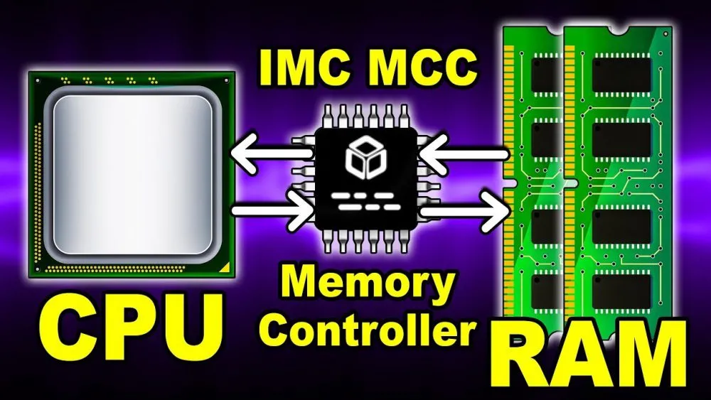
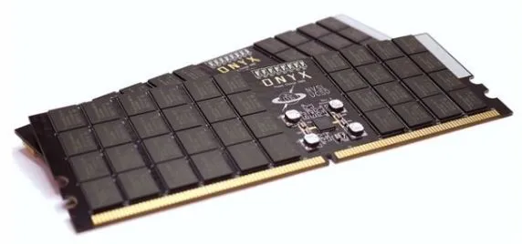

# IMC

En muchos procesadores, especialmente en los de hace algunas generaciones de Intel, **podíamos ver grabado en el IHS las siglas IMC.** Actualmente ya no lo hacen, pero eso no significa que hayan dejado de utilizarlo y, de hecho, a día de hoy **es uno de los componentes de los procesadores que tiene más importancia**.

Realmente el IMC es una de esas partes del procesador que no suelen tenerse en cuenta, y es que solo solemos fijarnos en los núcleos, la velocidad, y como mucho la memoria caché que tienen. Pero es un componente interno de los procesadores que tiene suma importancia.

### Qué es el IMC de un procesador

**IMC** son las siglas de **«Integrated Memory Controller»**, o **controlador de memoria integrado**. El controlador de memoria puede estar separado o integrado en otro chip, así que los que son integrados son aquellos que como supondrás, están integrados en el die del procesador. Antiguamente el controlador de memoria estaba en la placa base, pero desde hace ya bastante tiempo solo se utilizan IMC, ya que permite que el procesador controle la memoria de una manera más rápida y directa.

**El IMC es por lo tanto el circuito digital que controla el flujo de datos que va y viene entre el propio procesador y la memoria RAM.** Que esté integrado en el procesador permite que la administración de la RAM la pueda realizar de una manera más directa y rápida que cuando estaban los controladores de memoria en la placa base.

Antes de los AMD K8 (lanzados en 2003), los procesadores AMD tenían el controlador de memoria en su northbridge, pero en las siguientes generaciones **AMD fue pionera en integrarlo en el propio procesador**. Intel hizo lo propio por primera vez en los procesadores Nehalem, en 2008, y a partir de entonces ambos fabricantes utilizan únicamente IMC. Por cierto que los procesadores de arquitectura ARM también utilizan, en todos los casos, un controlador de memoria integrado en el procesador.

### ¿Cómo funciona el controlador de memoria?

**Los controladores de memoria contienen la lógica necesaria para leer y escribir en la memoria RAM, y para «refrescar» la DRAM.** Si no hubiera estos constantes «refrescos», la DRAM perdería los datos que contiene dado que los condensadores que contienen pierden la carga en una fracción de segundo (no más de **64 milisegundos según la especificación JEDEC**).

La lectura y escritura en la memoria RAM se realiza seleccionando las direcciones de datos de fila y columna de la DRAM como las entradas al circuito multiplexor, donde el demultiplexor en la DRAM usa las entradas convertidas para seleccionar la ubicación correcta de la memoria y devolver los datos, los cuales vuelven de nuevo a través de un multiplexor para consolidarse con el fin de reducir el ancho de bus requerido para la operación.

El **ancho del bus de memoria** representa el número de líneas paralelas disponibles para comunicarse con la celda de memoria. El ancho de bus de los controladores de memoria varían de 8 bits en sistemas antiguos a 512 bits en sistemas y tarjetas de vídeo más modernos. En las tarjetas de vídeo se emplean **cuatro controladores de memoria simultáneos de 64 bits** que funcionan en "modo grupo" donde se pueden usar dos controladores de memoria de 64 bits para acceder a un dispositivo de memoria de 128 bits.

Algunos controladores de memoria tienen, además, su propio sistema de corrección de errores que se puede complementar con el que incorporan muchos módulos de memoria RAM ya de por sí (lo cual es bueno porque los libera de carga en unos casos, y duplica la medida de corrección de errores en otros).

[^Líneas paralelas]: Trabajan en líneas paralelas pero envían sus datos en serie. No confundir con transmisión de datos en paralelo.

### Variantes de IMC existentes

Las especificaciones de los procesadores casi siempre se incluye una definición del tipo y velocidad de memoria RAM con la que son compatibles, precisamente dependiendo del IMC que incorporen. Por lo tanto, hay diferentes variantes de controlador de memoria, y algunos de ellos seguro que los reconocéis en seguida.

Por un lado están los **controladores DDR** que pueden ser (comúnmente) **dual-channel** y **quad-channel**. La diferencia es que en éstos la memoria RAM se separa en **2 ó 4 canales separados**, cada uno con un bus directo al controlador de memoria. Estos son los más utilizados en los PCs, y los que todos conocemos.

Por otro lado tenemos los controladores llamados FBM (**Fully Buffered Memory**) cuyo comportamiento difiere del anterior en que se coloca un dispositivo de buffer en cada módulo de memoria (llamado **FB-DIMM**) que usa un enlace de datos en serie al controlador (en lugar de ser en paralelo), disminuyendo el número de raíles necesarios para comunicarse a expensas de aumentar la latencia.

Finalmente, tenemos los controladores de **memoria Flash**, utilizada por dispositivos como los pen drives o los SSD. La memoria Flash es inherentemente más lenta que la DRAM y generalmente se vuelve inutilizable tras cierto número de ciclos de escritura, pero aun así necesita tener su propio controlador de memoria para poder comunicarse con el resto del sistema.