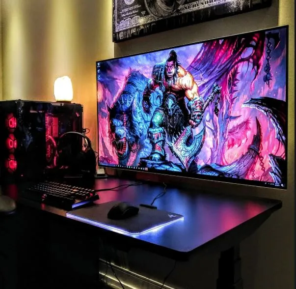
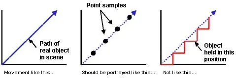
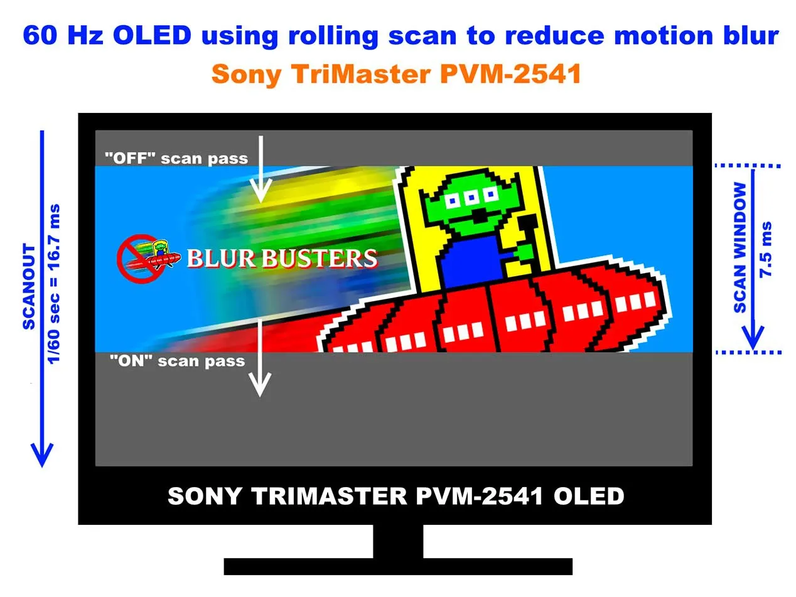

# ¿Por qué los OLED no son buenos para gaming?

Aunque siempre hablamos de pantallas gaming, la realidad es que la tecnología OLED en sus diferentes variantes se implementa en una gran cantidad de dispositivos tales como consolas portátiles o smartphones.

Estos al igual que las televisiones con tecnología OLED sufren el tan denostado **desenfoque de movimiento**, principal escollo de esta tecnología.

### OLED tiene que romper varias barreras antes de ser óptimo para gaming

Aunque los tiempos de respuesta entre píxeles son **casi cero**, la tecnología OLED representa un problema para los fabricantes por el llamado *Sample and Hold*, un efecto que va de la mano de lo que se conoce como persistencia.

Este efecto de **«muestra y retención»** lo que produce es que los frames representados en pantalla se queden estáticamente fijos en ella hasta que la tasa de actualización del panel los refresque.

Esto no tendría más inconveniente si no fuese porque nuestros ojos no están estáticos en una posición continuamente, lo que posibilita que al moverlos apreciemos ese efecto **motion blur** en pantalla, sobre todo si la tasa de hercios de refresco es baja.

El problema no se corrige con menor tiempo de respuesta de píxeles o menor tiempo de respuesta total, ya que es un problema de apreciación ocular muy evidente, por lo tanto, podríamos tener un **GtG de 0 y un MPRS casi de cero** que seguiría existiendo el problema.

### Solo habría una forma de solucionar el problema (en un futuro)

La solución puesto que los tiempos son mínimos actualmente pasa por reducir la cantidad de tiempo de muestra de cada frame. Solo hay dos caminos posibles para lograr esto: mucha mayor tasa de hercios en pantalla o forzar un escaneo continuo de la pantalla, el llamado **Rolling Scan**.

Esta técnica es distinta a las usadas en monitores gaming, ya que en estos se introduce una imagen completa en negro para mejorar la sensación de movimiento y suavidad. El problema es que esto requiere de un brillo bastante alto por norma, ya que tras la imagen en negro hay que representar un frame con un brillo mayor que la compense.

Esto no se puede hacer en OLED por su falta actual de brillo, aunque en la actualidad ha mejorado, así que Rolling Scan soluciona casi totalmente el problema. Se trata de una técnica que sincroniza el escaneo del panel con el escaneo del cable, sea **HDMI o DisplayPort**. Lo que se consigue es un tiempo muy inferior entre el llamado **On Scan pass** y el **Off scan pass**, lo que consigue un mayor número de pasadas de escaneo en el mismo tiempo que el monitor refresca totalmente la imagen.

Aun se están desarrollando técnicas para mejoras el brillo y las tasas de refresco de este tipo de pantallas para subsanar el **Motion Blur**.