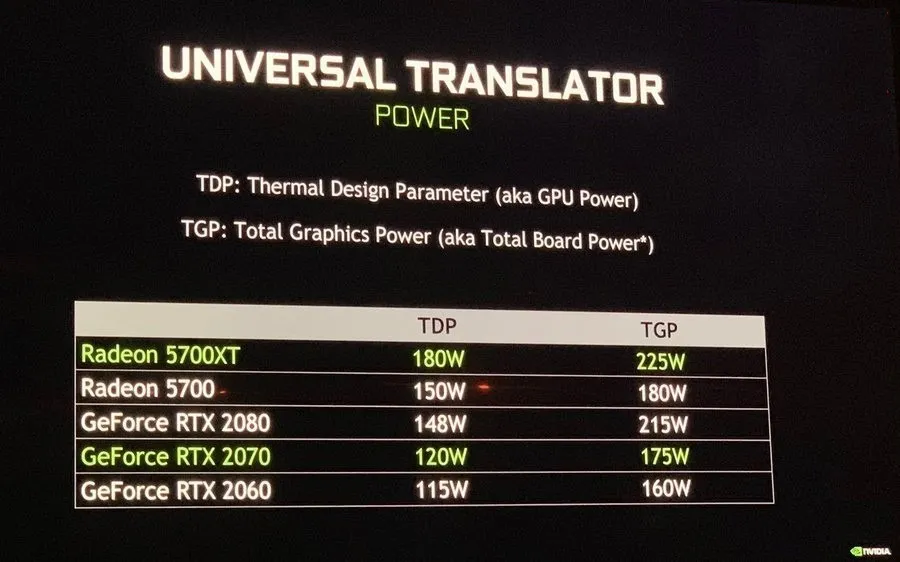
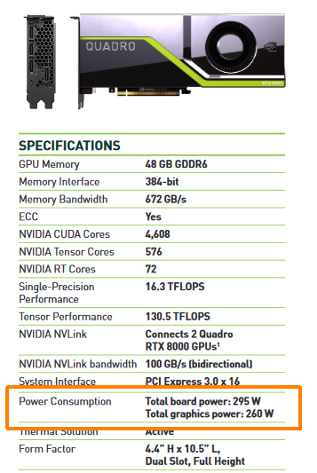

# TGP

Con la llegada de las AMD Radeon RX 5700, se introdujo un nuevo parámetro en las **especificaciones de las tarjetas gráficas** que no ha dejado indiferente ni siquiera a NVIDIA, pues se apresuraron de informar ellos también del mismo. Se trata del **TGP**, y en este artículo vamos a explicarte qué es, en qué se diferencia del **TDP** y por qué se debería tener en cuenta.

### ¿Qué es el TGP de una tarjeta gráfica?

TGP son las siglas en inglés de «**Total Graphics Power**«, o «**consumo gráfico total**» si lo traducimos al castellano. Se trata de, efectivamente, el consumo de energía que tiene la GPU de la tarjeta gráfica, y viene a sustituir la manera en la que definíamos hasta ahora el TDP. También se le llama **TBP** por «**Total Board Power**» o «*Typical Board Power*» en el caso de gráficas de AMD, y define el **consumo total de la gráfica** incluyendo GPU, memoria, VRMs, etc.

Por lo tanto, cuando estamos mirando qué fuente de alimentación es la más adecuada para nuestro sistema teniendo en cuenta la tarjeta gráfica, el parámetro que debemos tener en cuenta es el **TGP y no el TDP**, porque es el que nos dirá el consumo total del dispositivo. Y, como decíamos, ahora ambos fabricantes ya lo indican en las especificaciones de su producto, incluso en los de gama profesional.

### ¿ En qué se diferencia el TDP del TGP?

**TDP** viene del acrónimo en inglés **Thermal Design Power** (también conocido como Thermal Design Point y Thermal Design Parameter), **y se refiere a la cantidad de calor que necesita poder disipar el disipador** de la tarjeta gráfica en función del calor que genera la GPU. Por ejemplo, un TDP de 100 vatios significa que el disipador de la gráfica debe haber sido diseñado para disipar esa cantidad de calor, y no refleja el consumo de la GPU.

En resumen, estos son los términos que podemos encontrarnos:

- **TDP:** Thermal Design Power, la cantidad de calor que debe ser capaz de disipar el disipador. En gráficas lo usan para expresar el consumo solo de la GPU, no de la gráfica en su totalidad.
- **TGP:** Total Graphics Power, el consumo de energía total de la tarjeta gráfica.
- **TBP:** Total Board Power, equivalente al anterior.
- **GPC:** Graphics Card Power, equivalente a los anteriores.
- **MPC:** Max Power Consumption. En algunos casos podemos ver este término, y se refiere a la potencia pico que consume como máximo.