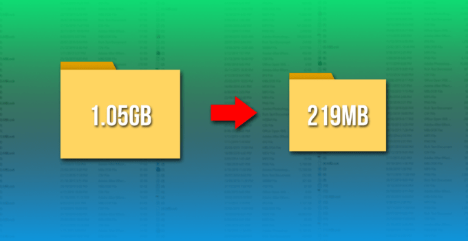
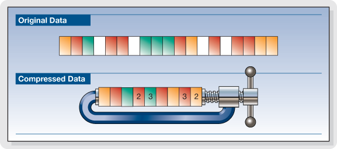
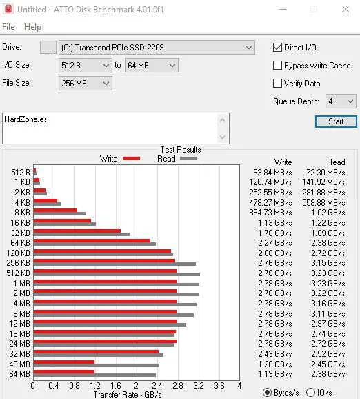
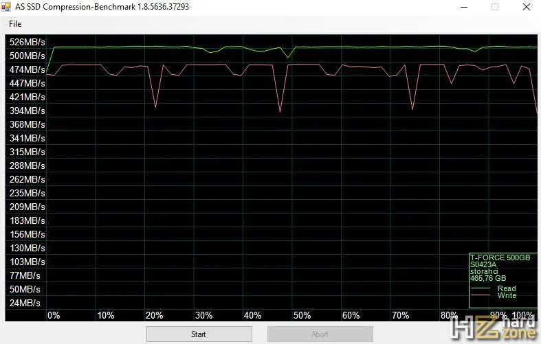

# SSD y archivos comprimidos

Es bien sabido que los **SSD** suelen tener bastantes **problemas de rendimiento** cuando tienen que trabajar con **archivos comprimidos**, con los que su rendimiento se ve drásticamente reducido.

Dependiendo del tamaño de asignación de archivo que configuremos a la hora de formatear una unidad de almacenamiento (sea SSD o no) influye en el modo y el rendimiento en el que el dispositivo gestiona los archivos. De igual manera, sucede que dependiendo de cómo se haya realizado la compresión le costará más o menos al SSD gestionar dichos archivos.

Dicho esto, vamos a empezar por el principio, porque para entender **qué causa estos problemas de rendimiento a los SSD con archivos comprimidos**, primero debemos entender cómo funciona la compresión de archivos.

### Cómo funciona la compresión de archivos

La compresión de archivos se conoce como «**Lossless Compression**», o **compresión sin pérdidas**. A diferencia de la «**Lossy Compression**» o **compresión con pérdidas** que se utiliza por ejemplo para vídeo o música, reducir el tamaño de los archivos no implica perder calidad. Literalmente, **la compresión con pérdidas reduce la calidad del archivo de audio o vídeo eliminando partes del mismo, y si hiciéramos eso en un archivo dejaría de funcionar.**

Por lo tanto, **la compresión de archivos siempre es sin pérdidas**, y su finalidad es la de agrupar varios archivos en uno solo que ocupe menos tamaño.

Imaginad que los archivos son **bloques de colores**, y al comprimirlos lo que estamos haciendo es juntar el mismo color en un solo bloque todas las veces posibles. Lo ideal es tener solo un bloque de cada color, pero muchas veces no es posible. Con la imagen de abajo podréis entenderlo fácilmente.

Evidentemente **esos bloques «desaparecidos» están anotados en un índice**, de manera que cuando queramos descomprimir el archivo sabremos exactamente dónde estaban y qué contenían para «restaurarlos» a su forma original.

Otro ejemplo para que lo veáis mejor, también con bloques de colores, pero con un escenario ideal en el que solo quedaría un bloque de cada color. Aquí tenemos **10 bloques: 2 azules, 3 rojos y 5 amarillos**. Al comprimirlos tendríamos solo tres bloques, uno de cada color y cada uno con un índice indicando lo que había originalmente.

#### Antes de comprimir

#### Después de comprimir

### ¿Por qué los SSD pierden rendimiento con archivos comprimidos?

Aquí es donde vuelve a entrar en juego el tamaño de asignación de archivo que comentábamos al principio. **Comprimir archivos significa reducir el tamaño de los mismos y además con un índice**, el **journaling** ([ver significado](./journaling.md)) es quien indica cómo era el archivo originalmente antes de comprimirlo.

Debido a esto, **los SSD ya tienen problemas de por sí con archivos pequeños**, así que imaginad si les estamos poniendo delante un contenedor con muchos archivos muy pequeños y que, además, para descifrarlos tienen que estar consultando un índice constantemente, y eso solo para saber qué son y qué tienen dentro. Este es el motivo principal por el que los SSD pierden mucho rendimiento cuando tienen que manejar archivos comprimidos.

*Fijaos en la siguiente captura del benchmark ATTO, como ejemplo. Aquí podemos ver que con archivos de pequeño tamaño el SSD tiene un rendimiento muy bajo, pero según los archivos van aumentando de tamaño, el rendimiento crece muchísimo.*

*Otro ejemplo, con AS SSD File Compression Benchmark, que nos muestra precisamente cómo se comporta el SSD cuando tiene que manejar archivos comprimidos. Estamos hablando de un SSD PCIe NVMe con un rendimiento de 3200 MB/s de lectura y 2800 MB/s de escritura, con algoritmos que favorecen un mejor rendimiento con archivos comprimidos y, aun así, el rendimiento se ve severamente penalizado.*

Esto es todavía más ostensible en **SSDs SATA 3**, donde la interfaz limita todavía más el ancho de banda del dispositivo para gestionar archivos.