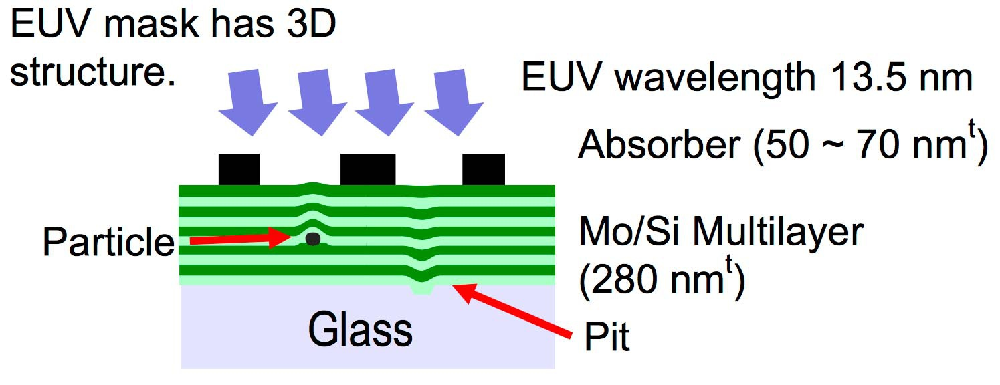
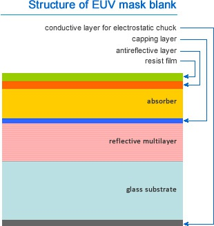

# ¿Cómo detectan los chip defectuosos AMD, Intel y Nvidia?

Tanto **NVIDIA como AMD e Intel** se encuentran con muchos problemas a la hora de crear sus chips, los cuales se encargan a diversos fabricantes. TSMC y Samsung se encargan de fabricarle los chips a AMD y Nvidia, mientras tanto Intel fabrica sus componentes internamente. Pero en todos se dan los mismos problemas, así que ¿Cómo detectan los chips defectuosos?

*Cada proceso litográfico ha sido un reto para cualquiera de las fundiciones existentes en el planeta. Cada nodo supone una serie de errores y problemas a solventar que a medida que se avanza se vuelven más y más complicados, por ello, tan importante es corregirlos como diagnosticarlos correctamente.*

### Deposición de haz de iones y máscaras, el santo grial de los problemas

La tecnología actual hasta la llegada de EUV se basaba en procesos de inmersión mediante grabados de máscaras que conformaban el **multi-pattern**.

*multi-patterning resumido: es una técnica que permite a los fabricantes superar el límite físico del silicio (40nm) para ello añaden "patrones (grabados) adicionales" para disminuir el tono y añaden espaciadores.*

Pero esto ya se acabo como tal, EUV ha revolucionado el mercado, el cual lleva esperando esta tecnología casi una década, por lo tanto la forma de abordar los problemas debe cambiar, así como los métodos de detección.

### Proceso

El primer paso es cambiar las llamadas máscaras en blanco, ya que aportan espacios en el silicio que deben ser corregidos a cada salto litográfico.

Para hacernos una idea, un proceso con EUV consiste en **40 o 50 capas de silicio** que se alternan con diferentes materiales de por medio.

Esto genera en las capas lo que se conocen como **defectos de partículas** y son cruciales, ya que modifican el rendimiento de las capas en blanco e impactarán en su estructura general. **A menor defecto de partículas mejores son las máscaras y menos errores se producen en la grabación de la oblea.**

### Herramientas de inspección óptica para detectar errores

Para detectar estos errores y poder avanzar en el proceso de creación de mejores máscaras y con ello grabados más perfectos, algunas empresas trabajan en lo que se conoce como **actinic blank inspection o ABI**. Estos sistemas tan complejos usan la misma longitud de onda que la lente que graba las obleas, donde en el caso de EUV son **13,5nm.**

*ABI* detecta los defectos de la oblea en los espacios en blanco, descartando los chips o incluso obleas enteras si el número de errores es muy elevado.

**El problema de no detectarlos a tiempo es que al imprimir la oblea estos fallos pueden matar a todos los chips impresos** y afectar al fabricante.

Los sistemas *ABI* son muy demandados por las fundiciones, el problema es que hay muy pocos de estos sistemas debido a su compleja fabricación.

### Si se detectan a tiempo, algunos defectos son corregibles

Lo mejor de la tecnología *ABI* es que permite la detección de errores y gracias a algunos de ellos pueden ser reparados por diferentes técnicas, otros en cambio no es posible tratarlos.

**Existen otros sistemas para la detección de errores, pero son menos precisos ya que trabajan a más nm, por lo que solo detectarán errores más comunes y no serán tan precisos como los sistemas *ABI*.**

Por la escasa existencia de sistemas *ABI*, los fabricantes de máscaras han creado dos metodologías  de inspección: **die a die y die a base de datos.**

En **die a die** se necesita insertar **los troqueles idénticos de las matrices en una misma máscara** y se va haciendo una inspección individual die a die. Esto lo realiza un sistema automatizado, el cual **si encuentra una diferencia entre el die y la máscara lo notifica y marca.**

Lo negativo de este sistema es que **solo funciona para chips de gran tamaño**, como algunos procesadores o GPUs y aqui es donde entra el segundo método, **die a base de datos**. **La diferencia con die a die es que en este caso la máscara de la herramienta de inspección compara el die con los datos de diseño originales en una base de datos**, lo cual lleva más tiempo porque los puntos a comprar son infinitamente más elevados que en el otro proceso.

Los fabricantes están usando estos dos métodos hasta que haya suficiente disponibilidad de la tecnología *ABI*. **Pero cabe destacar que estos dos métodos no son tan precisos ya que no pueden analizar con tanta precisión las máscaras EUV.**

