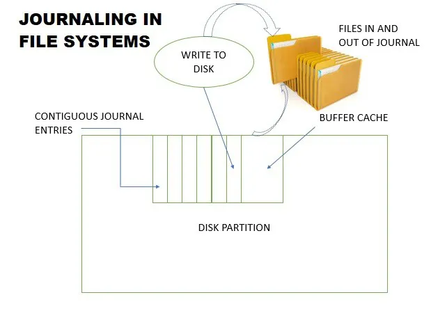

# Journaling

Todos los sistemas operativos utilizan un **sistema de archivos** propio para **almacenar los datos en el disco duro**. Windows usa NTFS, mientras que MacOS utiliza APFS y la mayoría de distribuciones de Linux emplean Ext4. Estos sistemas de archivos son fundamentalmente diferentes unos de otros, pero todos ellos utilizan una característica llamada **journaling**. En este artículo vamos a explicarte **qué es el journaling y por qué es importante**.

Estos sistemas de archivos cuentan con **un registro**, una especie de diario, **en el que se registra cada escritura en ese volumen**. Simplificando el proceso: cuando vamos a, por ejemplo, copiar un fichero a un volumen NTFS, se registra una entrada en este diario sobre la modificación que va a realizarse, y cómo deshacerla. Luego se realiza la escritura de la información, y cuando ésta termina, se elimina esa entrada del diario.

**Si el disco que contiene ese volumen se desconecta antes de finalizar la escritura, será el diario el que contenga la información de qué operaciones no se han realizado correctamente**, y de ese modo el sistema operativo podrá *volver atrás* para recuperar un sistema de archivos coherente.

### ¿Por qué es algo tan importante?

El objetivo de utilizar esta técnica es **reducir el espacio que requiere el índice** en el disco duro, y **aumentar la velocidad de acceso** a cualquier archivo. Esencialmente, en lugar de tener un índice con cientos de miles de entradas, se clasifican los archivos por categorías, indicándole al sistema de archivos dónde está cada cosa e incluyendo su registro de cambios, por lo que a su vez nos permite **evitar corrupción de datos** cuando se produce un apagado inesperado del disco duro.

Al escribir los cambios en este «diario» tan pronto como suceden, podemos asegurarnos de que cualquier cambio en los archivos quede registrado y que no se pierdan durante fallas en el disco duro o cortes de luz.